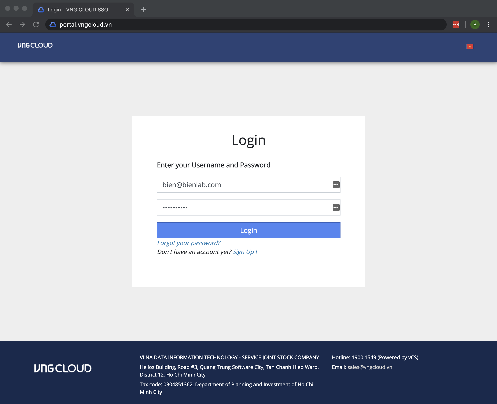
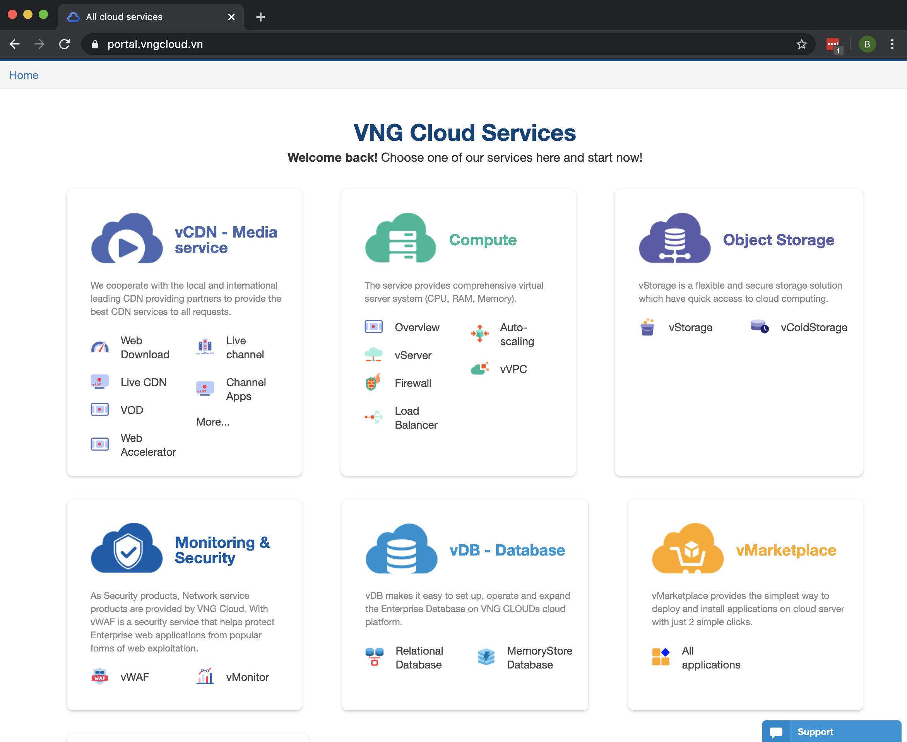
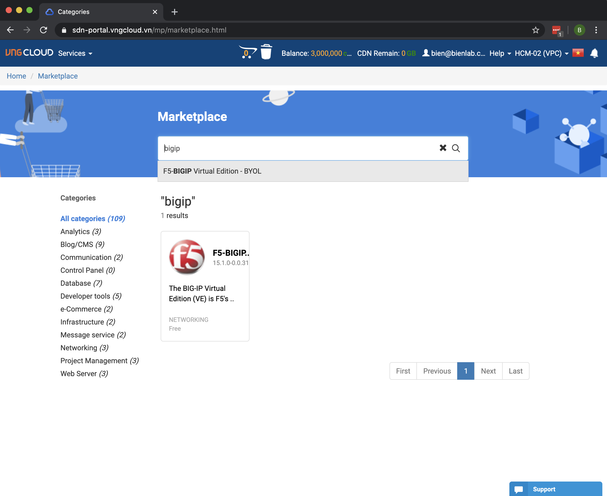
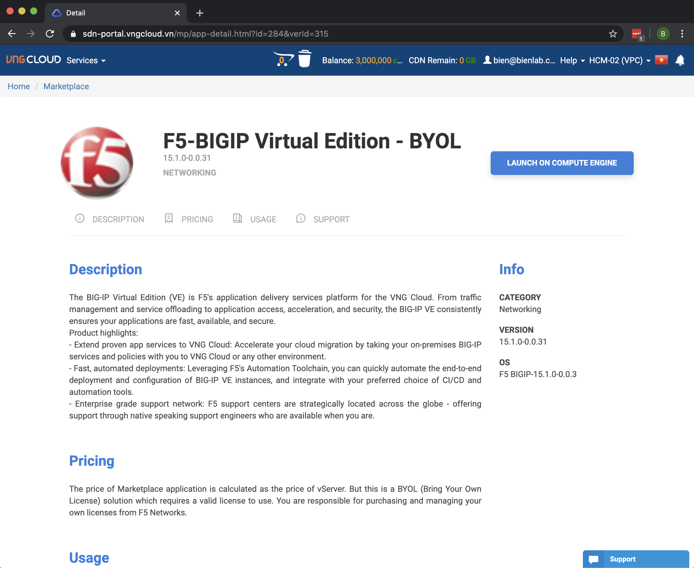
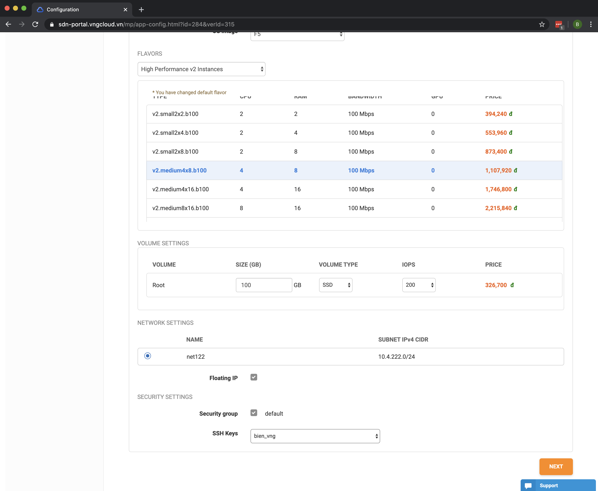
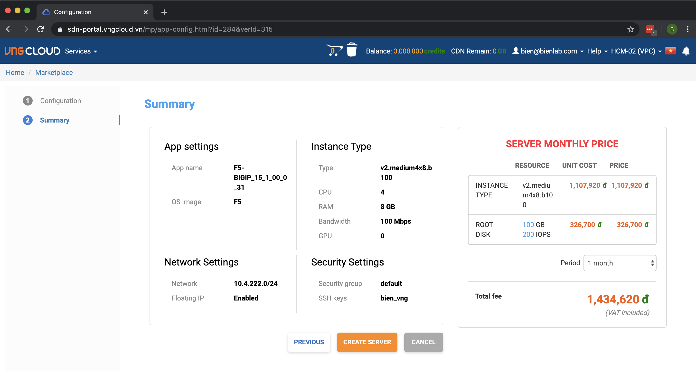
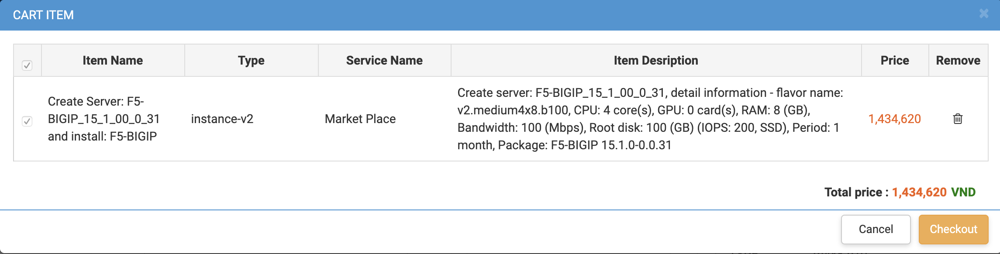
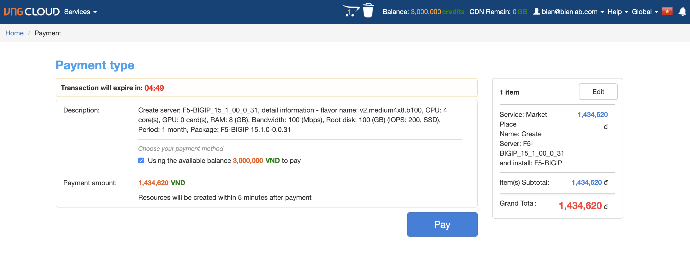
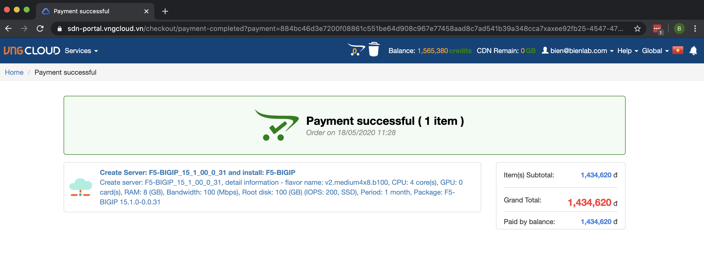
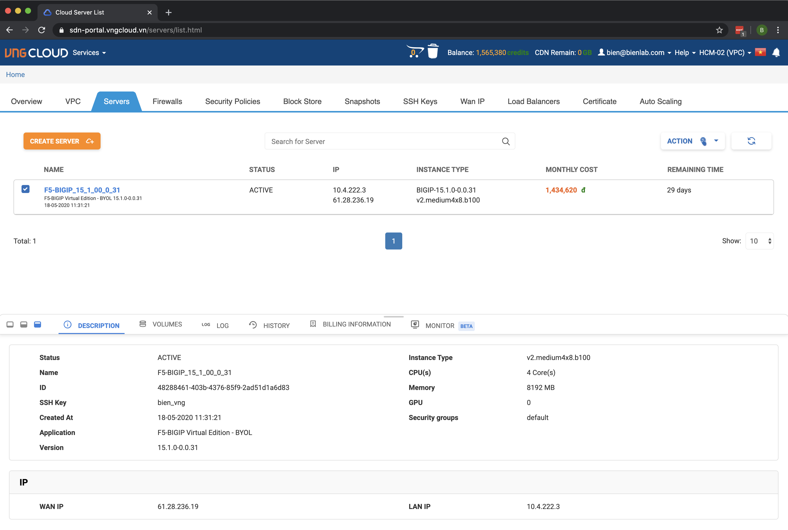

F5 BIG-IP on VNG Cloud basic setup

Launching F5 BIGIP Virtual Edition
-------------------------------

Login to the VNG Cloud Portal

From the landing page, click on vMarketplace

In the search text box of Marketplace, type bigip then select "F5-BIGIP Virtual Edtion - BYOL". 
BYOL means Bring Your Own Licence - You need to have your own license to utilize the instance. Please have the license key with you before proceeding to the next steps.
If you want to get the trial license, please go here https://www.f5.com/trials/big-ip-virtual-edition

Click on "LAUNCH ON COMPUTE ENGINE" from the product page of F5-BIGIP Virtual Edition - BYOL

Choose the instance flavor as you want. It's recommended that you should start with 16GB RAM and 4 vCPU, with at least 80GB storage as root volume

Below is the summary page of what will be created and the cost

Prepare to checkout..

Applying any coupon..

.. image:: _static/general/img/vng-bigip-checkout2.png

Make the payment..

Payment confirmation

Wait for about 5 to 10 minutes, your instance will be ready as shown in the example below

Accessing F5 BIGIP Instance Management Interface
---------------

Licensing your F5 BIGIP instance
-------------
abc d

Re-configure the network
-------------
abc d

Provisioning modules
-------------
abc d

Changing the password
-------------
You can continue with other tasks such as configuring NTP, timezone, hostname, DNS, remote syslog.. but they are optional sometimes. It's up to you.
You've just finished the basic setup of F5 BIGIP instance in VNG Cloud.

Congratulation! and do not forget to check out F5 Networks official support page
